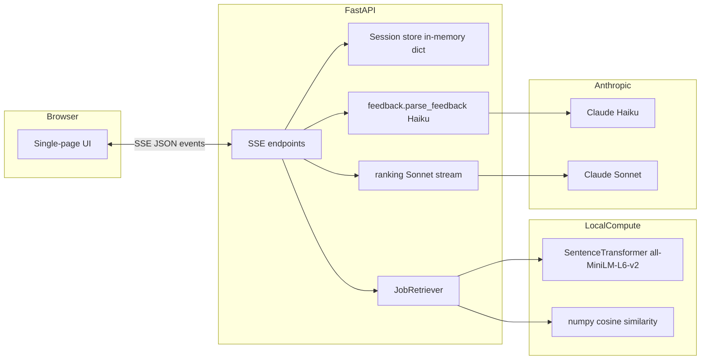

<p align="center">
  
</p>

# MatchLoop

**MatchLoop** is an iterative candidate-to-job matcher: a profile goes in, you get **three** explained recommendations, you give **natural-language feedback**, preferences update, and retrieval + ranking run again so the next shortlist actually reflects what you asked for.

This repo is intentionally small: **FastAPI** backend, **vanilla HTML/JS** frontend, **sentence-transformers** for retrieval, **Claude** for preference parsing and structured ranking. Sessions are **in-memory** (great for demos; but there is potential to swap for Redis if we need to harden for production).

---

## Table of contents

- [Requirements](#requirements)
- [Can I run it locally without an API key?](#can-i-run-it-locally-without-an-api-key)
- [Setup](#setup)
- [Run locally](#run-locally)
- [Configuration (.env)](#configuration-env)
- [What’s in `data/`](#whats-in-data)
- [Architecture & data flow](#architecture--data-flow)
- [Technology choices](#technology-choices)
- [Tunables & defaults](#tunables--defaults)
- [Design tradeoffs](#design-tradeoffs)
- [HTTP API (summary)](#http-api-summary)
- [Troubleshooting](#troubleshooting)
- [Deploy notes](#deploy-notes)

---

## Requirements

- **Python 3.11+** recommended (3.10 usually works; use 3.11+ for fewer edge cases with current wheels).
- **`ANTHROPIC_API_KEY`** — ranking and feedback parsing call the Anthropic API. Without a key, retrieval and the UI can load, but **session start and feedback will fail** once a model call is attempted.
- **Disk / RAM** — `sentence-transformers` will download `all-MiniLM-L6-v2` on first run; job matrix is held in memory (~1045 jobs × embedding dim).

---

## Can I run it locally without an API key?

**Not in a useful way.** All “intelligent” matching is done by:

- **Claude Sonnet** — scores and explains the top jobs (structured JSON).
- **Claude Haiku** — turns your feedback into preference deltas.

You can still open the app and load candidates, but **`POST /sessions` and feedback** require a valid key (or a stub service you’d have to build yourself). For local dev, use a key and optional low-`K` settings to minimize spend (see [Configuration](#configuration-env)).

---

## Setup

From the repo root:

```bash
python3 -m venv .venv
source .venv/bin/activate   # Windows: .venv\Scripts\activate
pip install -r requirements.txt
cp .env.example .env
```

Edit **`.env`** and set **`ANTHROPIC_API_KEY`**.

Ensure data files exist:

- `data/jobs.json` — job corpus (this repo ships **1045** YC-linked style listings).
- `data/candidates.json` — preset candidate profiles (or paste a candidate object in the UI).

On first startup the server builds **sentence embeddings for every job once** (progress bar in the terminal); after that retrieval is fast.

---

## Run locally

```bash
uvicorn backend.main:app --reload
```

Open **http://127.0.0.1:8000/** — root serves `frontend/index.html`; static assets mount under **`/static`**.

---

## Configuration (.env)

| Variable | Meaning | Default behaviour |
|---------|---------|-------------------|
| **`ANTHROPIC_API_KEY`** | Anthropic API authentication | Required for ranking & feedback parsing |
| **`DEMO_USERNAME`** | HTTP Basic auth username for app access | `interviewer` |
| **`DEMO_PASSWORD`** | HTTP Basic auth password for app access | `CoffeeSpace` |
| **`MATCHLOOP_RETRIEVE_K`** | How many jobs retrieval hands to Sonnet (`K`) | **`14`** if unset — Lower = less context, cheaper; **`30`** aligns with heavier “take-home parity” setups |
| **`MATCHLOOP_RANK_DESC_MAX_CHARS`** | Max characters **per job description** in the **ranking** prompt only | **`3200`** if unset — Set **`0`** for **no truncation** (much higher token usage) |

Example for **full descriptions + larger shortlist** (watch TPM / rate limits on your tier):

```env
ANTHROPIC_API_KEY=sk-ant-...
DEMO_USERNAME=interviewer
DEMO_PASSWORD=CoffeeSpace
MATCHLOOP_RETRIEVE_K=30
MATCHLOOP_RANK_DESC_MAX_CHARS=0
```

---

## What’s in `data/`

| File | Role |
|------|------|
| `jobs.json` | Array of jobs (`title`, `company`, `url`, `description`, `location`, `salary`, `yc_batch`, …). Indexed at startup. |
| `candidates.json` | Preset profiles for the dropdown; you can instead **paste a candidate JSON object** in the UI (same general shape). |

Locations are normalized at load time (`backend/location_display.py`) so noisy ATS strings (e.g. huge remote country-code lists) don’t swamp the UI.

---

## Architecture & data flow

High-level pipeline:



**Round 1 — `POST /sessions`**

1. Build **`retrieval_summary`** (keyword-dense string for embeddings) and **`ranking_context`** (long-form narrative: employers, bullets, prefs context) via `summarizer.py`.
2. **Retrieve** top-`K` jobs: embed **three** retrieval queries (candidate summary; preference terms; blended) and union high-similarity results, excluding URLs in **`seen_urls`**.
3. **Rank** those `K` jobs with **Sonnet**: full rubric 0–1, structured JSON — top **3** recommendations, **match_factors**, three rationale sections (**general**, **preferences/feedback**, **watchouts**). Streamed over SSE as `ranking_chunk`, then `session_complete`.

**Later rounds — `POST /sessions/{id}/feedback`**

1. **Haiku** parses feedback into `add_must` / `add_nice` / `add_avoid` / removals; may return “clarification needed” without mutating session until useful feedback exists.
2. Re-run **retrieve** with updated preference-weighted query and **seen_urls** (no repeat URLs).
3. Re-run **Sonnet** ranking with updated **`PreferenceState`** and same rich context.

**Why SSE?** So the UI can show progress while Sonnet streams; errors are surfaced as **`{ "type": "error", "message": "..." }`** instead of dropping the TCP connection (which browsers often label “Network Error”).

---

## Technology choices

| Layer | Choice | Why |
|-------|--------|-----|
| API | **FastAPI** | Simple async-friendly app, easy JSON/SSE |
| Frontend | **Static HTML + JS** | No build step; easy to iterate with the backend |
| Retrieval | **`sentence-transformers` / MiniLM-L6-v2** | Good speed/quality tradeoff; runs fully local; matrix in RAM |
| Similarity | **NumPy cosine** | No external vector DB for the demo; easy to swap for Pinecone/pgvector later |
| Preference parsing | **Claude Haiku** | Cheap, fast JSON extraction from messy user text |
| Ranking & explanation | **Claude Sonnet** | Strong structured output and long-form reasoning for three-section bullets |
| Config | **`python-dotenv`** | Local `.env` without committing secrets |

---

## Tunables & defaults

| Parameter | Where | Typical values / notes |
|-----------|--------|------------------------|
| **Job corpus size** | `data/jobs.json` | **1045** jobs in the shipped dataset |
| **`K` (retrieve_k)** | `MATCHLOOP_RETRIEVE_K` | **14** default; **30** for broader shortlist to Sonnet |
| **Description cap** | `MATCHLOOP_RANK_DESC_MAX_CHARS` | **3200** chars/job default; **0** = full text |
| **Ranking `max_tokens`** | `ranking.py` | **3500** (room for 3 jobs × rich JSON + sectioned bullets) |
| **Preference list caps** | `feedback.py` | Dedup + cap per category (keeps prompts small) |
| **Multi-query retrieval** | `retrieval.py` | **3** queries blended to improve recall |

---

## Design tradeoffs

1. **`K` vs cost/quality`** — Fewer jobs = lower tokens and fewer 429s; more jobs = better chance the true best role is in Sonnet’s window.
2. **Truncated descriptions** — Default cap protects TPM; full text (`CHARS=0`) matches “read the whole posting” but can hit limits on small tiers.
3. **Re-retrieve every round** — Preferences change the **candidate** side of retrieval (and `seen_urls` shrinks the pool). We don’t only re-rank the same frozen set; that would ignore “I want remote only” style shifts.
4. **Avoid terms** — Used heavily in **ranking** prompts; **not** naively negated in embedding space (negation and embeddings don’t mix well).
5. **In-memory sessions** — Simple and fast for demos; **lost on process restart**; not multi-node safe.
6. **Sonnet streaming + JSON** — Stream improves UX; final payload must parse as JSON (with retry path if the model drifts).
7. **Two profile formats** — Dense text for retrieval vs narrative dossier for ranking so each model gets the right kind of signal.

---

## HTTP API (summary)

| Method | Path | Purpose |
|--------|------|---------|
| `GET` | `/` | Serves the web UI |
| `GET` | `/candidates` | Dropdown metadata (index, name, title/headline) |
| `POST` | `/sessions` | Start session — body: `candidate_index` **or** `candidate` object — **SSE** stream |
| `POST` | `/sessions/{session_id}/feedback` | Body: `{ "feedback": "..." }` — **SSE** stream |
| `GET` | `/sessions/{session_id}/state` | Debug: round, prefs, seen URL count |

SSE event types (representative): `ranking_chunk`, `session_complete`, `feedback_complete`, `error`.

---

## Troubleshooting

| Symptom | Likely cause |
|---------|----------------|
| **“Network error” / stream dies** | Unhandled server exception before an SSE `error` event — check **uvicorn logs** |
| **429 / rate limits** | Lower **`MATCHLOOP_RETRIEVE_K`**, set description cap, or upgrade tier |
| **`USE_TF` / Keras noise** | Repo sets **`USE_TF=0`** in `main.py` to avoid optional TensorFlow in sentence-transformers stacks |
| **Embeddings slow first time** | Model download + one-time encode of all jobs |

---

## Deploy notes

- **`Procfile`** runs Uvicorn bound to **`0.0.0.0:$PORT`** for platforms like Heroku/Railway/Render.
- Set **`ANTHROPIC_API_KEY`**, **`DEMO_USERNAME`**, **`DEMO_PASSWORD`**, and any **`MATCHLOOP_*`** vars in the host’s config.
- The app is protected by **HTTP Basic auth** middleware. Every request (UI and API) requires the configured username/password.
- Remember: **sessions are in-memory** — single dyno only, or add a real store later.

---

## License

Add your preferred license (e.g. MIT) if you open-source this repo publicly.
